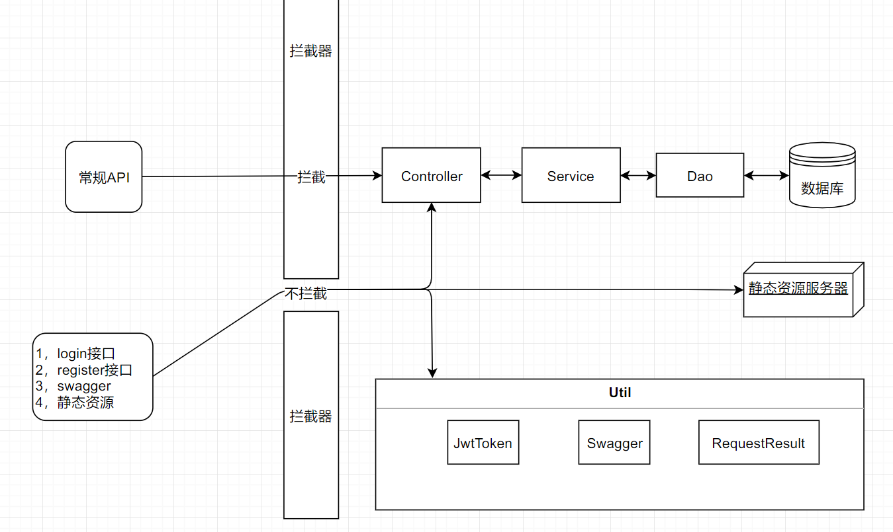
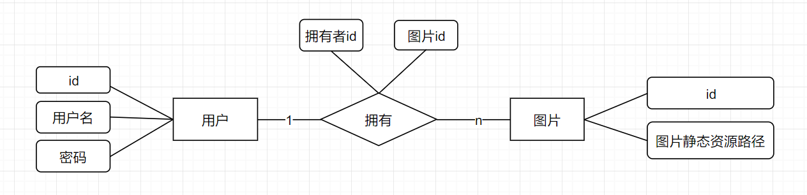
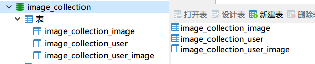
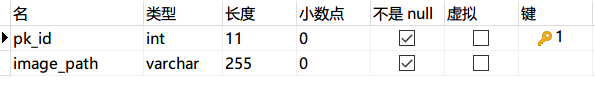
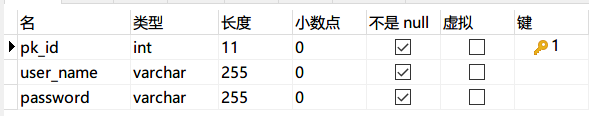
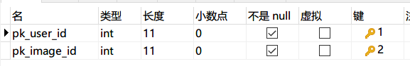
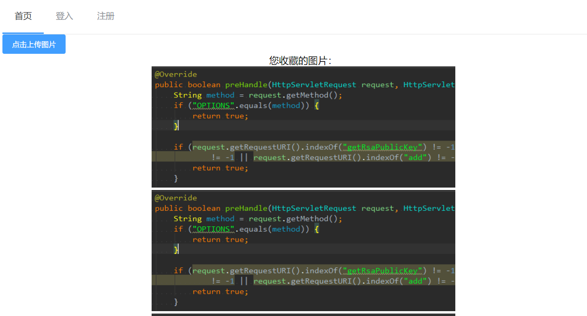

# 一，前言

> 阶段性的学习Demo，对代码，文档等进行了一些规范
>

# 二，项目介绍

### 一，开发环境

- 操作系统：Windows10，JDK：1.8
- 前端
  - Vue.js
  - Element-ui
- 后端
  - Springboot
    - swagger
    - JWT
    - Lombok
    - MyBatis
  - mysql
- 工具
  - Postman
  - Typora

### 二，项目结构图

### 三，项目简介

实现了用户的登陆注册，权限的限制，并且用户可以向服务器上传图片，并直接访问静态资源

此项目作为联系项目涉及到了：

| 名称           | 说明                             |
| -------------- | -------------------------------- |
| JWT技术        | 验证用户身份和控制权限           |
| Lombok         | 简化POJO                         |
| 静态资源服务器 | 上传，直接访问静态资源           |
| Swagger2       | 后端接口文档的生成               |
| 接口封装       | 自定义接口封装信息，符合接口规范 |

# 三，数据库

### 一，E-R图

### 二，关系模式

用户（<u>用户id</u>，用户名，密码）

用户图片（<u>拥有者id，图片id</u>）

图片（<u>图片id</u>，图片静态资源路径）

### 三，物理存储结构

- 图片
  - 
- 用户
  - 
- 用户图片
  - 

### 四，数据库SQl文件

详情参照本项目Resource目录

# 四，后端

> 重点部分如下：

1. Lombok的使用：三个注解
2. JWT验证原理：对称加密，非对称加密和有状态服务，无状态服务
3. cookie的不可跨域性：利用header和Vuex解决
4. 静态资源服务器：文件上传和静态资源访问
5. 接口的封装：{code，message，result}，泛型和Object的各自优势
6. Swagger：后端API文档的生成

# 五，前端

> 重点部分如下：

1. 配置跨域：映射地址替代
2. cookie与Vuex的同步：从header中获取token，保存到cookie中，随后将cookie数据同步到Vuex中
3. Axios请求拦截器：自定义添加请求头

# 六，最终实现效果

